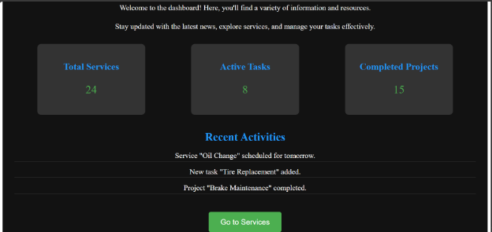

UNIVERSITATEA DE STAT DIN MOLDOVA 

FACULTATEA „MATEMATICĂ ŞI INFORMATICĂ” 

DEPARTAMENTUL “INFORMATICĂ”

*Lucru individual*

**Raport pentru Aplicația Web de Gestionare a unui Service Auto**

Realizat : Stoian Vladimira 

Grupa: IA2201 

Verificat: Nartea Nichita

Chisinau, 2024
## **Descrierea proiectului**
### **Scopul aplicației:**
Aplicația de gestionare a unui service auto este un sistem web construit pentru a facilita programările la un service auto. Utilizatorii pot alege dintr-o varietate de servicii disponibile pentru vehiculele lor și pot programa data și ora dorită pentru fiecare serviciu. Aplicația include funcționalități pentru gestionarea utilizatorilor (Admin, Manager, User), autentificare pe bază de sesiuni și stocarea informațiilor despre programările efectuate.
### **Funcționalități principale:**
1. **Autentificare și gestionare utilizatori**:
   1. **Login**: Utilizatorii se pot autentifica pe aplicație folosind un sistem de autentificare bazat pe sesiuni.
   1. **Roluri utilizatori**: Există trei tipuri de roluri utilizator: Admin, Manager și User, fiecare cu diferite nivele de acces.
   1. **Gestionare parole**: Parolele sunt criptate înainte de a fi stocate în baza de date, utilizând tehnici de hashing.
1. **Formular de programare a serviciilor**:
   1. Utilizatorii pot selecta un serviciu dintr-o listă prestabilită (ex: schimb de ulei, înlocuire de anvelope, diagnosticare motor).
   1. Formularul include câmpuri pentru completarea numelui, selecția serviciului, data și ora dorită pentru programare.
1. **Vizualizarea programărilor**:
   1. După completarea formularului, programările sunt stocate și afișate într-un chenar vizualizat pe aceeași pagină.
   1. Datele programărilor rămân persistente chiar și după reîncărcarea paginii, datorită utilizării localStorage.
1. **Interfață modernă și responsive**:
   1. Aplicația folosește o temă întunecată cu efecte de hover și focus pe butoane și câmpuri de input.
   1. Interfața este responsive și se adaptează pe orice dimensiune a ecranului (desktop, tabletă, telefon).
1. **Stocarea datelor**:
   1. Datele din formularul de programare sunt stocate temporar folosind localStorage în browserul utilizatorului, astfel încât programările nu se pierd după reîncărcarea paginii.
1. **UI Intuitiv**:
   1. Butoanele, câmpurile de input și meniurile sunt stilizate și ușor de utilizat, pentru a oferi o experiență de utilizator plăcută.

Backend-ul

1\.Migragiile

Rutele:

Funcționalități CRUD:

Pentru Frontend am folosit Vite + Vue
### **Crearea componentelor**
Vom organiza aplicația în componente:

- **HomePage.vue**: Pagina principală.
- **Login.vue**: Formulare pentru autentificare.
- **Dashboard.vue**: Gestionarea utilizatorilor și vehiculelor.
- **Bookings.vue**: Vizualizare și gestionare programări.

Aplicația include câteva secțiuni și funcționalități importante:

1. **Pagina de autentificare** (pentru Admin, Manager, User)
1. **Dashboard** (pentru utilizatorii autentificați)
1. **Lista de servicii** (pentru administrarea mașinilor, reparațiilor etc.)
1. **Formulare de contact sau programări**

LoginPage.vue

ServicePage.Vue

DashboardPage.Vue (pagina principal)

Pentru a porni aplicatia utlizam:

**npm run serve**

**Capturi de ecran**

**Pagina de Login:**

User: admin

Parola: admin123

**Dashboard-ul**

## **Lista surselor utilizate**
- [**Vue.js**](https://vuejs.org/) – pentru crearea interfeței utilizatorului și gestionarea componentelor.
- [**Axios**](https://axios-http.com/) – pentru gestionarea cererilor HTTP (dacă se folosește un server backend).
- [**Font Awesome**](https://fontawesome.com/) – pentru iconițele din interfața aplicației.
- [**LocalStorage API**](https://developer.mozilla.org/en-US/docs/Web/API/Window/localStorage) – pentru stocarea datelor local în browserul utilizatorului.
- **Vue Router** – pentru gestionarea rutelor și navigării între pagini.
## **Informații suplimentare**
### **1. Securitate și gestionarea sesiunilor**
Aplicația include un sistem de autentificare pe bază de sesiuni, care protejează datele sensibile ale utilizatorilor. Fiecare utilizator are un cont protejat printr-o parolă criptată (utilizând un algoritm de hashing precum bcrypt). După autentificare, utilizatorii pot accesa diferite funcționalități ale aplicației, în funcție de rolul atribuit (Admin, Manager, User). Acest sistem de roluri asigură că fiecare utilizator are acces doar la părțile aplicației relevante pentru nivelul său de permisiuni.
### **2. Persistența datelor**
Aplicația folosește localStorage pentru a salva informațiile despre programările utilizatorilor pe partea clientului. Aceasta permite utilizatorilor să păstreze datele chiar și după ce pagină este reîncărcată, asigurând astfel o experiență mai fluidă și continuă. Datele sunt salvate într-un format JSON și sunt afișate într-un chenar organizat pe ecran.
### **3. Interfața utilizatorului**
Designul aplicației a fost gândit să fie intuitiv și accesibil. În plus față de o temă întunecată modernă, cu culori de fundal în nuanțe de gri închis și albastru, aplicația include animații și efecte de hover pentru butoane și câmpuri de input. Aceste efecte îmbunătățesc experiența utilizatorului și fac aplicația mai plăcută la utilizare.

De asemenea, aplicația este complet responsive, ceea ce înseamnă că va arăta și va funcționa corect pe orice dispozitiv: de la telefoane mobile, tablete până la desktopuri. Utilizatorii pot interacționa cu aplicația indiferent de dimensiunea ecranului, ceea ce face aplicația ușor accesibilă într-o varietate de scenarii.
### **4. Gestionarea programărilor**
Aplicația oferă utilizatorilor un formular complet pentru a selecta și a programa diferite servicii pentru vehiculele lor. După completarea formularului, utilizatorul poate vizualiza lista programărilor sale într-o zonă dedicată pe aceeași pagină. Programările sunt stocate și afișate într-un mod ordonat, făcând ușor de urmărit serviciile programate pentru o anumită dată și oră.
### **5. Extensibilitate și scalabilitate**
Aplicația este construită într-un mod modular, ceea ce permite extinderea ușoară a funcționalităților sale. De exemplu, este simplu să adăugați mai multe servicii de auto pentru a extinde lista disponibilă, să modificați rolurile utilizatorilor sau să implementați noi funcționalități, precum gestionarea stocurilor de piese auto sau programarea reparațiilor periodice.
## **Concluzie**
Aplicația de gestionare a unui service auto reprezintă o soluție eficientă și ușor de utilizat pentru programarea și gestionarea serviciilor auto. Cu un design modern și o interfață user-friendly, aplicația permite utilizatorilor să navigheze ușor și să-și programeze serviciile într-un mod intuitiv.

Sistemul de autentificare și gestionarea sesiunilor asigură securitatea datelor utilizatorilor, iar persistența datelor prin localStorage adaugă un plus de confort, garantând că informațiile programărilor sunt păstrate chiar și după reîncărcarea paginii. Funcționalitățile sunt complet personalizabile și ușor de extins, oferind o bază solidă pentru un sistem mai complex de management al unui service auto.

În plus, aplicația este complet responsivă, adaptându-se pe diferite dispozitive și asigurându-se că utilizatorii beneficiază de o experiență de utilizare consistentă indiferent de tipul de dispozitiv. Cu un sistem de role utilizatori (Admin, Manager, User), aplicația poate fi ușor administrată și configurată în funcție de cerințele business-ului.

În concluzie, această aplicație este o bază solidă pentru dezvoltarea unui sistem de gestionare a unui service auto online, având un design flexibil și scalabil pentru a sprijini viitoare extinderi și îmbunătățiri ale funcționalităților.

